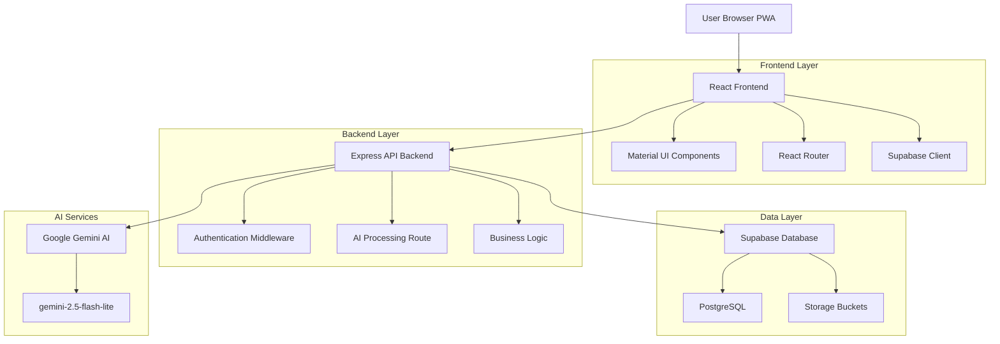
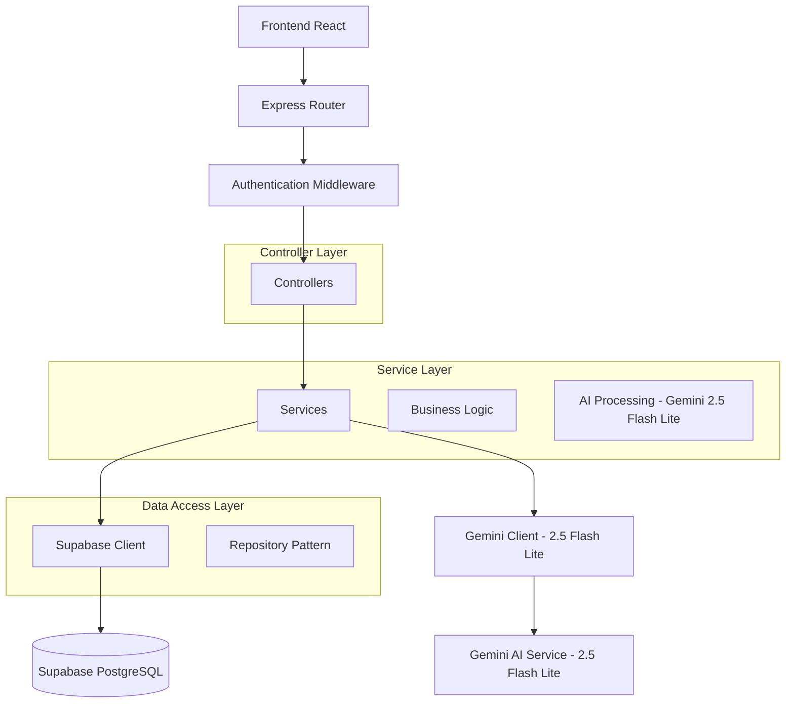
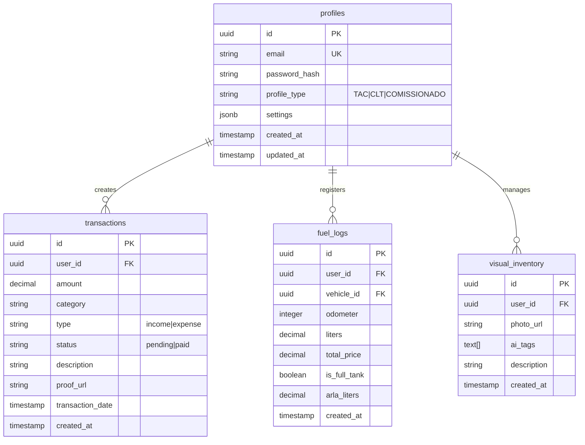

## 1. Architecture design



## 2. Technology Description

- **Frontend**: React@18 + TypeScript@5 + Vite@5
- **UI Framework**: Material UI@5 (@mui/material, @mui/icons-material)
- **State Management**: React Context + useState/useEffect
- **Initialization Tool**: vite-init
- **Backend**: Express@4 + TypeScript
- **Database**: Supabase (PostgreSQL@15)
- **AI Integration**: @google/generative-ai@latest (**gemini-2.5-flash-lite**)
- **PWA**: vite-plugin-pwa@0.19
- **Additional**: react-router-dom@6, @supabase/supabase-js@2

## 3. Route definitions

| Route | Purpose |
|-------|---------|
| / | Dashboard adaptativo baseado no perfil do motorista |
| /login | Tela de login com seleção de perfil TAC/CLT/Comissionado |
| /register | Cadastro com validação de dados e seleção de perfil |
| /transactions | Lista e formulário de lançamentos financeiros |
| /fuel | Registro de abastecimento com cálculo de média |
| /inventory | Inventário visual com upload de fotos e tags IA |
| /profile | Configurações do usuário e metas |
| /api/auth/* | Rotas de autenticação (login, logout, refresh) |
| /api/ai/process | Processamento multimodal (texto + imagem) via Gemini 2.5 Flash Lite |
| /api/transactions | CRUD de transações financeiras |
| /api/fuel-logs | CRUD de registros de combustível |
| /api/visual-inventory | CRUD de inventário visual |

## 4. API definitions

### 4.1 Authentication API

```
POST /api/auth/login
```

Request:
| Param Name | Param Type | isRequired | Description |
|------------|------------|------------|-------------|
| email | string | true | Email do motorista |
| password | string | true | Senha (mínimo 6 caracteres) |

Response:
| Param Name | Param Type | Description |
|------------|------------|-------------|
| user | object | Dados do usuário (id, email, profile_type) |
| token | string | JWT token para autenticação |
| expires_in | number | Tempo de expiração em segundos |

### 4.2 AI Processing API (Gemini 2.5 Flash Lite)

```
POST /api/ai/process
```

Request:
| Param Name | Param Type | isRequired | Description |
|------------|------------|------------|-------------|
| input_type | string | true | "text" ou "image" |
| content | string | true | Texto ou base64 da imagem |
| context | string | false | Contexto adicional (opcional) |

Response:
| Param Name | Param Type | Description |
|------------|------------|-------------|
| category | string | Categoria detectada (frete, diesel, chapa, etc.) |
| amount | number | Valor extraído (quando aplicável) |
| type | string | "income" ou "expense" |
| description | string | Descrição detalhada |
| odometer | number | Odômetro extraído (quando aplicável) |
| tags | array | Tags para inventário visual |
| model_version | string | "gemini-2.5-flash-lite" |

### 4.3 Transaction API

```
POST /api/transactions
```

Request:
| Param Name | Param Type | isRequired | Description |
|------------|------------|------------|-------------|
| amount | number | true | Valor da transação |
| category | string | true | Categoria do ENUM |
| type | string | true | "income" ou "expense" |
| description | string | false | Descrição opcional |
| proof_url | string | false | URL da foto do comprovante |

## 5. Server architecture diagram



## 6. Data model

### 6.1 Data model definition



### 6.2 Data Definition Language

**Profiles Table**
```sql
CREATE TABLE profiles (
  id UUID PRIMARY KEY DEFAULT gen_random_uuid(),
  email VARCHAR(255) UNIQUE NOT NULL,
  password_hash VARCHAR(255) NOT NULL,
  profile_type VARCHAR(20) CHECK (profile_type IN ('TAC', 'CLT', 'COMISSIONADO')),
  settings JSONB DEFAULT '{}',
  created_at TIMESTAMP WITH TIME ZONE DEFAULT NOW(),
  updated_at TIMESTAMP WITH TIME ZONE DEFAULT NOW()
);

CREATE INDEX idx_profiles_email ON profiles(email);
CREATE INDEX idx_profiles_type ON profiles(profile_type);
```

**Transactions Table**
```sql
CREATE TABLE transactions (
  id UUID PRIMARY KEY DEFAULT gen_random_uuid(),
  user_id UUID REFERENCES profiles(id) ON DELETE CASCADE,
  amount DECIMAL(10,2) NOT NULL,
  category VARCHAR(50) CHECK (category IN ('frete', 'adiantamento', 'saldo', 'diesel', 'arla', 'pedagio', 'chapa', 'diaria', 'quebra_caixa', 'manutencao')),
  type VARCHAR(10) CHECK (type IN ('income', 'expense')),
  status VARCHAR(20) DEFAULT 'pending' CHECK (status IN ('pending', 'paid')),
  description TEXT,
  proof_url TEXT,
  transaction_date DATE DEFAULT CURRENT_DATE,
  created_at TIMESTAMP WITH TIME ZONE DEFAULT NOW()
);

CREATE INDEX idx_transactions_user_id ON transactions(user_id);
CREATE INDEX idx_transactions_category ON transactions(category);
CREATE INDEX idx_transactions_date ON transactions(transaction_date);
```

**Fuel Logs Table**
```sql
CREATE TABLE fuel_logs (
  id UUID PRIMARY KEY DEFAULT gen_random_uuid(),
  user_id UUID REFERENCES profiles(id) ON DELETE CASCADE,
  vehicle_id UUID,
  odometer INTEGER NOT NULL,
  liters DECIMAL(8,2) NOT NULL,
  total_price DECIMAL(10,2) NOT NULL,
  is_full_tank BOOLEAN DEFAULT FALSE,
  arla_liters DECIMAL(8,2) DEFAULT 0,
  created_at TIMESTAMP WITH TIME ZONE DEFAULT NOW()
);

CREATE INDEX idx_fuel_user_vehicle ON fuel_logs(user_id, vehicle_id);
CREATE INDEX idx_fuel_full_tank ON fuel_logs(is_full_tank);
```

**Visual Inventory Table**
```sql
CREATE TABLE visual_inventory (
  id UUID PRIMARY KEY DEFAULT gen_random_uuid(),
  user_id UUID REFERENCES profiles(id) ON DELETE CASCADE,
  photo_url TEXT NOT NULL,
  ai_tags TEXT[],
  description TEXT,
  created_at TIMESTAMP WITH TIME ZONE DEFAULT NOW()
);

CREATE INDEX idx_inventory_user_id ON visual_inventory(user_id);
CREATE INDEX idx_inventory_tags ON visual_inventory USING GIN(ai_tags);
```

**Supabase Row Level Security (RLS)**
```sql
-- Enable RLS
ALTER TABLE profiles ENABLE ROW LEVEL SECURITY;
ALTER TABLE transactions ENABLE ROW LEVEL SECURITY;
ALTER TABLE fuel_logs ENABLE ROW LEVEL SECURITY;
ALTER TABLE visual_inventory ENABLE ROW LEVEL SECURITY;

-- Basic access policies
CREATE POLICY "Users can view own profile" ON profiles FOR SELECT USING (auth.uid() = id);
CREATE POLICY "Users can update own profile" ON profiles FOR UPDATE USING (auth.uid() = id);

CREATE POLICY "Users can view own transactions" ON transactions FOR SELECT USING (auth.uid() = user_id);
CREATE POLICY "Users can create own transactions" ON transactions FOR INSERT WITH CHECK (auth.uid() = user_id);
CREATE POLICY "Users can update own transactions" ON transactions FOR UPDATE USING (auth.uid() = user_id);

CREATE POLICY "Users can view own fuel logs" ON fuel_logs FOR SELECT USING (auth.uid() = user_id);
CREATE POLICY "Users can create own fuel logs" ON fuel_logs FOR INSERT WITH CHECK (auth.uid() = user_id);

CREATE POLICY "Users can view own inventory" ON visual_inventory FOR SELECT USING (auth.uid() = user_id);
CREATE POLICY "Users can create own inventory" ON visual_inventory FOR INSERT WITH CHECK (auth.uid() = user_id);

-- Grant permissions
GRANT SELECT ON profiles TO anon;
GRANT SELECT ON profiles TO authenticated;
GRANT ALL ON profiles TO authenticated;

GRANT SELECT ON transactions TO authenticated;
GRANT ALL ON transactions TO authenticated;

GRANT SELECT ON fuel_logs TO authenticated;
GRANT ALL ON fuel_logs TO authenticated;

GRANT SELECT ON visual_inventory TO authenticated;
GRANT ALL ON visual_inventory TO authenticated;
```