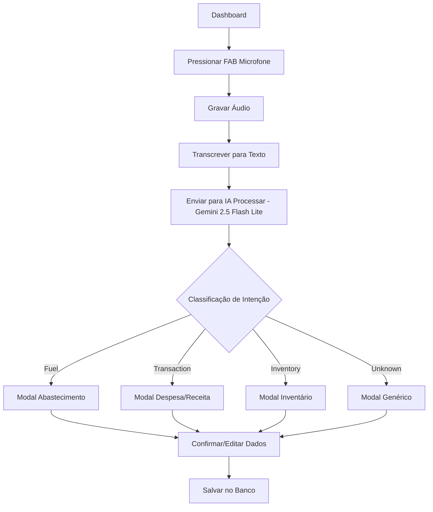
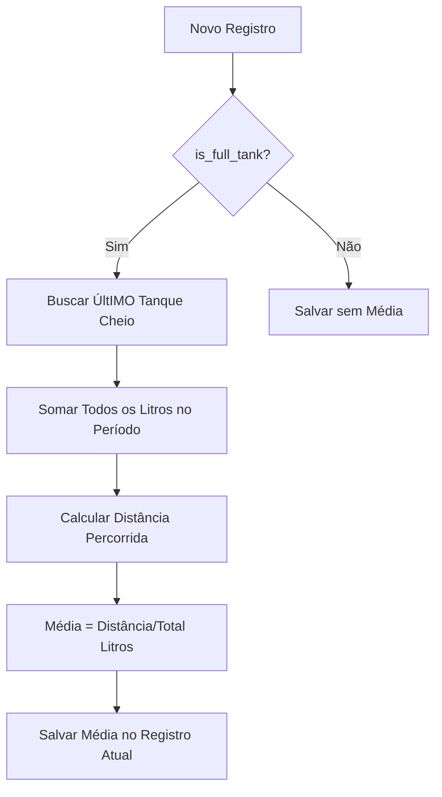

## 1. Visão Geral do Produto
Transformação do MVP atual em um Assistente AI-First para caminhoneiros, priorizando entrada de dados via áudio e imagem. O sistema atua como roteador de intenções, automatizando o registro de informações financeiras, de combustível e inventário com mínima interação manual.

**Valor Principal:** Reduzir em 80% o tempo de digitação para caminhoneiros através de processamento inteligente de voz e imagem usando **Google Gemini 2.5 Flash Lite**.

## 2. Funcionalidades Principais

### 2.1 Papeis de Usuário
| Papel | Método de Acesso | Permissões Principais |
|------|------------------|----------------------|
| Caminhoneiro TAC | Cadastro com CPF/CNH | Acesso completo às funcionalidades financeiras e de gestão |
| Caminhoneiro CLT | Cadastro com CTPS | Acesso limitado ao controle de diárias e reembolsos |
| Caminhoneiro Comissionado | Convite da transportadora | Acesso ao cálculo de comissões e despesas relacionadas |

### 2.2 Módulos do Sistema
O sistema consiste nos seguintes módulos principais:

1. **Dashboard AI-First**: Interface principal com FAB de microfone para entrada por voz
2. **Confirmação Inteligente**: Modais dinâmicos pré-preenchidos pela **Gemini 2.5 Flash Lite** para revisão
3. **Gestão de Combustível**: Cálculo automático de média entre tanques cheios
4. **Controle Financeiro**: Dashboard adaptativo baseado no perfil do usuário
5. **Inventário Inteligente**: Reconhecimento de itens e sugestões de compras via IA

### 2.3 Detalhamento das Funcionalidades
| Página/Módulo | Componente | Descrição da Funcionalidade |
|---------------|------------|----------------------------|
| Dashboard AI-First | FAB Microfone | Botão flutuante central (60px+) que ativa gravação por voz ao ser pressionado |
| Dashboard AI-First | Transcrição em Tempo Real | Converter fala em texto usando Web Speech API durante gravação |
| Dashboard AI-First | Processamento IA | Enviar texto/imagem para `/api/ai/process` usando **Gemini 2.5 Flash Lite** e aguardar classificação de intenção |
| Confirmação Inteligente | Modal Dinâmico | Exibir formulário pré-preenchido baseado no tipo detectado (fuel/transaction/inventory) pela IA |
| Confirmação Inteligente | Validação Visual | Campos destacados para revisão com botões "Confirmar" e "Editar" |
| Gestão Combustível | Algoritmo de Média | Calcular média apenas entre registros consecutivos de tanque cheio |
| Gestão Combustível | Validação de Dados | Prevenir cálculos com odômetro menor que o anterior |
| Financeiro TAC | Fluxo de Caixa | Exibir (Adiantamentos + Saldos) - (Diesel + Despesas) como métrica principal |
| Financeiro TAC | Saldo a Receber | Destacar valores pendentes de recebimento |
| Financeiro CLT | Controle Diária | Comparar valor da diária recebida contra gastos reais |
| Inventário | Reconhecimento Visual | Processar imagem da despensa usando **Gemini 2.5 Flash Lite** e listar itens detectados |
| Inventário | Sugestões IA | Recomendar itens essenciais faltantes (arroz, feijão, óleo, sal, café, açúcar) via IA |

## 3. Fluxos Principais

### Fluxo de Entrada por Voz

### Fluxo de Cálculo de Média de Combustível

## 4. Design de Interface

### 4.1 Estilo Visual
- **Modo**: Dark Mode obrigatório
- **Cores Primárias**: `#121212` (fundo), `#1E1E1E` (superfície)
- **Cores de Acabamento**: `#FFC107` (âmbar), `#FF6F00` (laranja escuro)
- **Texto**: `#FFFFFF` (primário), `#B0B0B0` (secundário)
- **Botões**: Mínimo 60px de altura, cantos arredondados, ícones filled grandes

### 4.2 Elementos por Página
| Página | Componente | Especificações de Design |
|--------|------------|-------------------------|
| Dashboard | FAB Microfone | Centralizado, 72px diâmetro, ícone de microfone filled, cor âmbar |
| Dashboard | Status de Gravação | Animação pulsante durante gravação, texto "Gravando..." |
| Modal Confirmação | Campos de Formulário | Labels grandes (18px+), inputs com 60px altura, botões primários destacados |
| Modal Confirmação | Feedback Visual | Snackbar para sucesso/erro, nunca usar alert() nativo |
| Financeiro | Cards Métricas | Layout em grid responsivo, números grandes (24px+), cores por contexto |

### 4.3 Responsividade
- **Abordagem**: Mobile-First com PWA
- **Breakpoints**: 320px (mínimo), 768px (tablet), 1024px (desktop)
- **Touch**: Otimização para interação com luvas, elementos mínimos 60px
- **Orientação**: Suportar portrait e landscape com layouts adaptativos