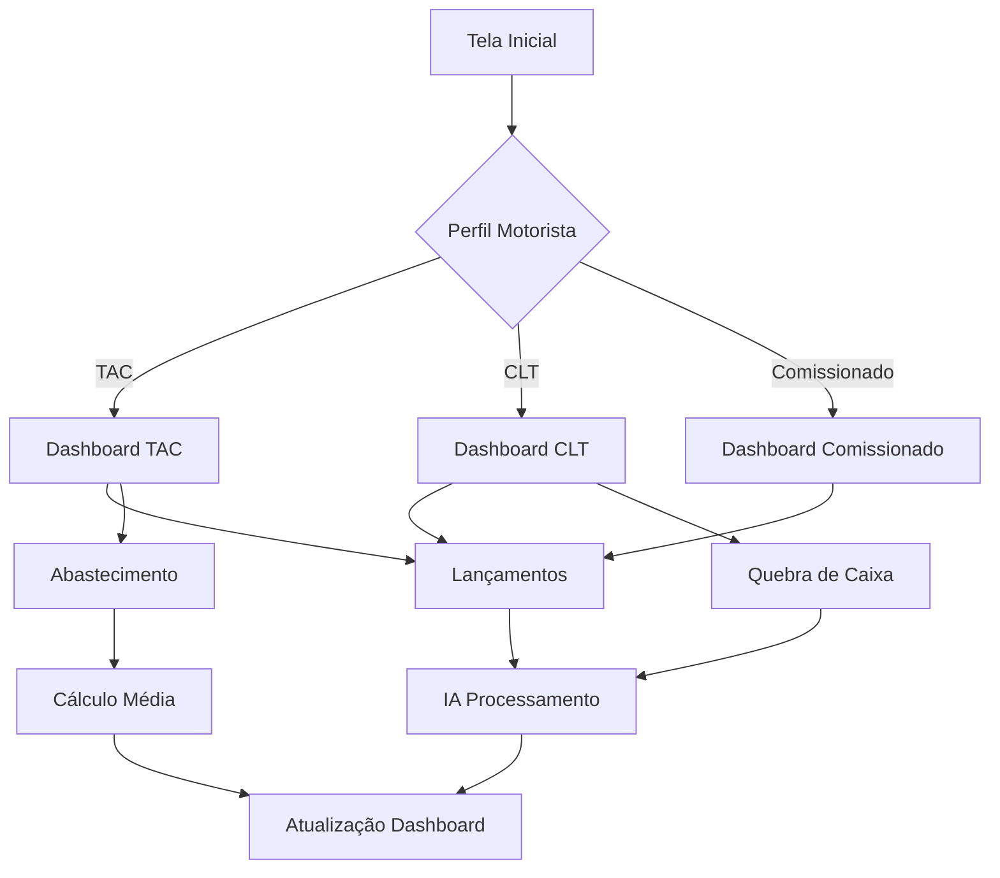

## 1. Product Overview

O Copiloto de Estrada é um assistente financeiro e operacional PWA para caminhoneiros brasileiros. Resolve o problema da gestão financeira complexa no transporte rodoviário, adaptando-se ao perfil do motorista (autônomo, CLT ou comissionado) e oferecendo interface ultra-simples para quem tem dificuldade com tecnologia.

O produto visa democratizar o controle financeiro no setor de transportes, permitindo que motoristas de qualquer idade gerenciem despesas, calculem médias de consumo e organizem documentos através de interface visual intuitiva com suporte a fotos e IA.

## 2. Core Features

### 2.1 User Roles

| Role                   | Registration Method      | Core Permissions                                                 |
| ---------------------- | ------------------------ | ---------------------------------------------------------------- |
| Motorista TAC          | Email ou telefone        | Acesso completo ao financeiro, cálculo de lucro com adiantamento |
| Motorista CLT          | Email corporativo        | Controle de diárias, reembolsos, quebra de caixa                 |
| Motorista Comissionado | Código da transportadora | Visualização de base de comissão, relatórios de viagem           |

### 2.2 Feature Module

O aplicativo Copiloto de Estrada consiste nas seguintes páginas principais:

1. **Dashboard**: Visão geral adaptativa baseada no tipo de motorista, cards financeiros, saldo a receber.
2. **Lançamentos**: Registro de despesas e receitas com categorias pré-definidas, suporte a fotos de comprovantes.
3. **Abastecimento**: Controle de combustível com cálculo automático de média apenas quando tanque cheio.
4. **Inventário Visual**: Registro fotográfico de itens com tags geradas por IA para organização.
5. **Perfil**: Configurações do motorista, metas de consumo, valor hora extra.
6. **Login/Registro**: Seleção de perfil TAC/CLT/Comissionado durante cadastro.

### 2.3 Page Details

| Page Name         | Module Name            | Feature description                                                                                                                                                 |
| ----------------- | ---------------------- | ------------------------------------------------------------------------------------------------------------------------------------------------------------------- |
| Dashboard         | Visão Geral            | Mostra cards adaptativos baseados no perfil: TAC exibe "Lucro da Viagem" e "Saldo a Receber", CLT exibe "Diárias vs Gastos", Comissionado exibe "Base de Comissão". |
| Dashboard         | Cards Financeiros      | Cards grandes com números em fonte 24px+, botões FAB para ações rápidas (Adicionar Despesa, Novo Abastecimento).                                                    |
| Lançamentos       | Formulário de Despesa  | Campos: Valor (teclado numérico grande), Categoria (dropdown com ícones), Descrição, Foto do Comprovante (câmera), Status (Pendente/Pago).                          |
| Lançamentos       | Lista de Lançamentos   | Lista cronológica com cards expansíveis, filtro por categoria, indicador visual de pendente/pago.                                                                   |
| Abastecimento     | Formulário Combustível | Odômetro (numérico), Litros Diesel, Preço Total, checkbox "Encheu o tanque?", campo separado Arla 32.                                                               |
| Abastecimento     | Histórico              | Lista com média calculada apenas quando tanque cheio, destaque visual para registros válidos para cálculo.                                                          |
| Inventário Visual | Câmera/Upload          | Captura de foto ou upload, preview da imagem, campo descrição manual.                                                                                               |
| Inventário Visual | IA Tags                | Botão "Analisar com IA" que gera tags automáticas, permite edição manual das tags.                                                                                  |
| Perfil            | Dados Pessoais         | Nome, email, telefone, CPF, CNH (opcional).                                                                                                                         |
| Perfil            | Configurações Tipo     | Exibe tipo selecionado (não editável), metas de consumo (km/l), valor hora extra.                                                                                   |
| Login/Registro    | Seleção Perfil         | Botões grandes com ícones e descrição simples: "Sou autônomo", "Sou funcionário", "Trabalho com comissão".                                                          |
| Login/Registro    | Formulário             | Email/telefone, senha, confirmação, termos de uso checkbox grande.                                                                                                  |

## 3. Core Process

### Fluxo Motorista TAC (Autônomo):

1. Usuario chega no Dashboard → Visualiza Lucro Atual e Saldo a Receber
2. Aperta FAB "Nova Despesa" → Registra gasto com foto
3. Aperta FAB "Novo Abastecimento" → Informa odômetro, litros, preço
4. Sistema calcula automaticamente média quando tanque cheio
5. Dashboard atualiza Lucro = (Frete + Adiantamento) - Despesas

### Fluxo Motorista CLT:

1. Dashboard mostra Diárias Disponíveis vs Gastas
2. Botão "Quebra de Caixa" → Tira foto de recibo pequeno
3. Sistema categoriza automaticamente via IA
4. Lista mostra todos reembolsos pendentes
5. Relatório mensal disponível para impressão

### Fluxo Motorista Comissionado:

1. Dashboard destaca Base de Cálculo da Comissão
2. Lançamentos focam em despesas que afetam comissão
3. Visualização de percentuais e valores projetados

## 4. User Interface Design

### 4.1 Design Style

* **Cores Primárias**: Fundo #121212, Superfície #1E1E1E, Texto #FFFFFF

* **Cores de Ação**: Amber #FFC107 para botões principais, Deep Orange #FF5722 para alertas

* **Botões**: Altura mínima 60px, cantos arredondados, sombra suave, ícones grandes (32px+)

* **Tipografia**: Fonte sistema nativa, títulos 24px+, texto corpo 18px, mínimo 16px

* **Layout**: Card-based com espaçamento generoso (16-24px), BottomNavigation fixa

* **Ícones**: Material Icons filled, tamanho padrão 32px, contraste 4.5:1 mínimo

### 4.2 Page Design Overview

| Page Name     | Module Name       | UI Elements                                                                                      |
| ------------- | ----------------- | ------------------------------------------------------------------------------------------------ |
| Dashboard     | Cards Financeiros | Cards com altura 120px+, números em fonte 32px bold, ícones 48px, background gradient sutil      |
| Dashboard     | FAB Principal     | Botão flutuante 72px, ícone 36px, posicionado 24px do canto                                      |
| Lançamentos   | Formulário        | Inputs com altura 72px, labels 18px, placeholders em alto contraste, teclado numérico automático |
| Abastecimento | Checkbox Tanque   | Switch grande 60px, label "Encheu o tanque?" em fonte 20px                                       |
| Inventário    | Preview Foto      | Container 200x200px, border dashed 2px, ícone câmera 64px, texto instrução 16px                  |
| Login         | Botões Perfil     | Cards clicáveis 150x200px, ícones 64px, descrição 14px, hover effect sutil                       |

### 4.3 Responsiveness

* **Mobile-First**: Design base para telas 360px+, escala proporcional para tablets

* **Desktop**: Layout adaptativo com max-width 600px centralizado, mantendo proporções mobile

* **Touch**: Áreas clicáveis mínimo 48x48px, espaçamento entre elementos 16px+

* **Orientação**: Suporte portrait principal, landscape com scroll vertical mantido

