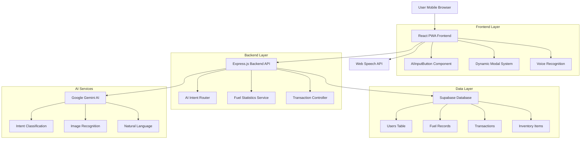
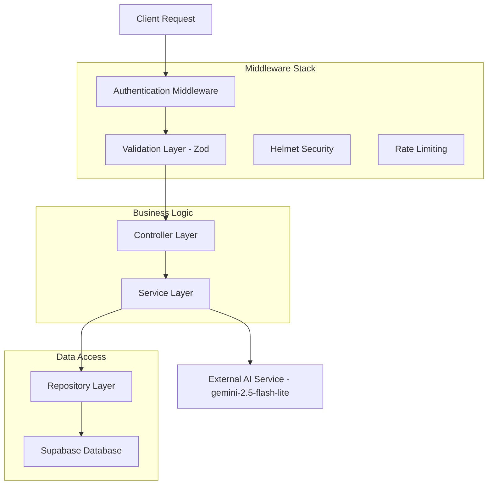
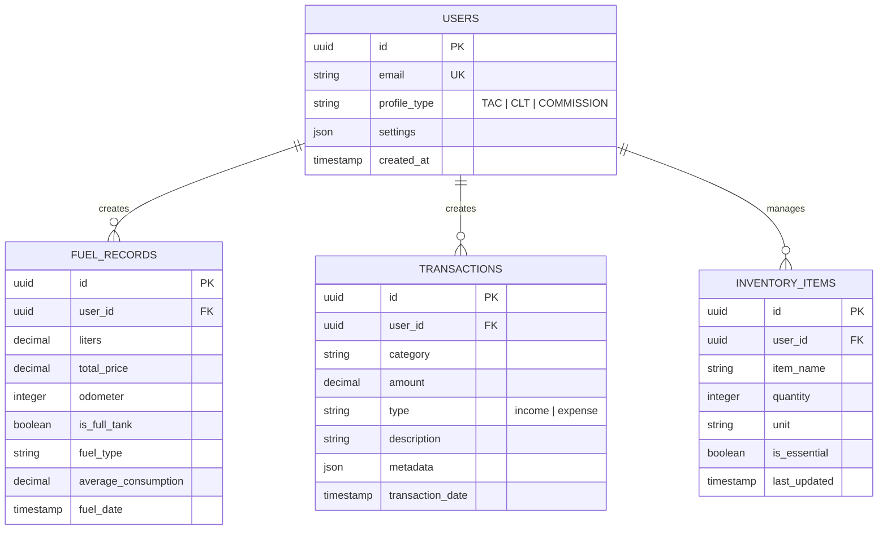

## 1. Arquitetura do Sistema



## 2. Stack Tecnológica

- **Frontend:** React@18 + TypeScript + Vite
- **UI Framework:** Material-UI v5 (MUI)
- **Backend:** Express.js@4 + TypeScript
- **Database:** Supabase (PostgreSQL)
- **AI Engine:** Google Gemini SDK (`@google/generative-ai`) - **Modelo: gemini-2.5-flash-lite**
- **Speech Recognition:** Web Speech API (navegador)
- **Initialization Tool:** vite-init

## 3. Definições de Rotas

| Rota | Propósito |
|------|-----------|
| `/` | Dashboard principal com FAB de entrada por voz |
| `/login` | Autenticação do usuário |
| `/profile` | Configuração de perfil e preferências |
| `/fuel` | Histórico de abastecimentos e médias |
| `/transactions` | Lista de despesas e receitas |
| `/inventory` | Gestão de itens da cozinha/cabine |

### Rotas API Backend
| Rota | Método | Descrição |
|------|--------|-----------|
| `/api/ai/process` | POST | Processar entrada de texto/imagem e classificar intenção usando gemini-2.5-flash-lite |
| `/api/fuel` | POST | Registrar novo abastecimento |
| `/api/fuel/stats` | GET | Obter estatísticas de consumo |
| `/api/transactions` | POST | Criar nova transação |
| `/api/transactions/summary` | GET | Resumo financeiro por período |
| `/api/inventory` | POST | Atualizar inventário |
| `/api/inventory/suggest` | GET | Sugerir itens faltantes |

## 4. Definições de API

### 4.1 AI Processing Endpoint (gemini-2.5-flash-lite)
```
POST /api/ai/process
```

Request:
| Parâmetro | Tipo | Obrigatório | Descrição |
|-----------|------|-------------|-----------|
| input_text | string | false* | Texto transcrito da fala |
| input_image | base64 | false* | Imagem codificada em base64 |
| user_id | uuid | true | ID do usuário autenticado |

*Um dos dois deve ser fornecido

Response:
```json
{
  "intent": "fuel" | "transaction" | "inventory" | "unknown",
  "confidence": 0.95,
  "data": {
    "category": "diesel",
    "amount": 850.50,
    "liters": 250,
    "odometer": 125430,
    "is_full_tank": true,
    "items": ["arroz", "feijão"],
    "missing_suggestion": ["óleo", "sal"]
  },
  "suggested_action": "create_fuel_record",
  "model_version": "gemini-2.5-flash-lite"
}
```

### 4.2 Fuel Record Creation
```
POST /api/fuel
```

Request:
| Parâmetro | Tipo | Obrigatório | Descrição |
|-----------|------|-------------|-----------|
| liters | number | true | Quantidade de combustível |
| total_price | number | true | Valor total pago |
| odometer | number | true | Quilometragem atual |
| is_full_tank | boolean | true | Se foi tanque cheio |
| fuel_type | string | true | "diesel" ou "arla32" |
| station_name | string | false | Nome do posto |

## 5. Arquitetura do Servidor



## 6. Modelo de Dados

### 6.1 Diagrama Entidade-Relacionamento


### 6.2 Definições de Tabela (DDL)

**Tabela de Usuários:**
```sql
CREATE TABLE users (
    id UUID PRIMARY KEY DEFAULT gen_random_uuid(),
    email VARCHAR(255) UNIQUE NOT NULL,
    password_hash VARCHAR(255) NOT NULL,
    name VARCHAR(100) NOT NULL,
    profile_type VARCHAR(20) CHECK (profile_type IN ('TAC', 'CLT', 'COMMISSION')),
    settings JSONB DEFAULT '{}',
    created_at TIMESTAMP WITH TIME ZONE DEFAULT NOW(),
    updated_at TIMESTAMP WITH TIME ZONE DEFAULT NOW()
);

-- Índices para performance
CREATE INDEX idx_users_email ON users(email);
CREATE INDEX idx_users_profile_type ON users(profile_type);
```

**Tabela de Registros de Combustível:**
```sql
CREATE TABLE fuel_records (
    id UUID PRIMARY KEY DEFAULT gen_random_uuid(),
    user_id UUID REFERENCES users(id) ON DELETE CASCADE,
    liters DECIMAL(10,2) NOT NULL CHECK (liters > 0),
    total_price DECIMAL(10,2) NOT NULL CHECK (total_price > 0),
    odometer INTEGER NOT NULL CHECK (odometer > 0),
    is_full_tank BOOLEAN NOT NULL DEFAULT false,
    fuel_type VARCHAR(20) CHECK (fuel_type IN ('diesel', 'arla32')),
    average_consumption DECIMAL(10,2),
    station_name VARCHAR(255),
    fuel_date TIMESTAMP WITH TIME ZONE DEFAULT NOW(),
    created_at TIMESTAMP WITH TIME ZONE DEFAULT NOW()
);

-- Índices para queries frequentes
CREATE INDEX idx_fuel_user_date ON fuel_records(user_id, fuel_date DESC);
CREATE INDEX idx_fuel_full_tank ON fuel_records(user_id, is_full_tank, fuel_date DESC);
```

**Tabela de Transações:**
```sql
CREATE TABLE transactions (
    id UUID PRIMARY KEY DEFAULT gen_random_uuid(),
    user_id UUID REFERENCES users(id) ON DELETE CASCADE,
    category VARCHAR(50) NOT NULL,
    amount DECIMAL(10,2) NOT NULL,
    type VARCHAR(10) CHECK (type IN ('income', 'expense')),
    description TEXT,
    metadata JSONB DEFAULT '{}',
    transaction_date DATE NOT NULL,
    created_at TIMESTAMP WITH TIME ZONE DEFAULT NOW()
);

CREATE INDEX idx_transactions_user_date ON transactions(user_id, transaction_date DESC);
CREATE INDEX idx_transactions_type ON transactions(user_id, type);
```

### 6.3 Permissões Supabase (RLS)

```sql
-- Permitir leitura básica para usuários anônimos
GRANT SELECT ON users TO anon;
GRANT SELECT ON fuel_records TO anon;
GRANT SELECT ON transactions TO anon;

-- Permitir acesso completo para usuários autenticados
GRANT ALL PRIVILEGES ON users TO authenticated;
GRANT ALL PRIVILEGES ON fuel_records TO authenticated;
GRANT ALL PRIVILEGES ON transactions TO authenticated;
GRANT ALL PRIVILEGES ON inventory_items TO authenticated;

-- Políticas de segurança (Row Level Security)
ALTER TABLE fuel_records ENABLE ROW LEVEL SECURITY;
ALTER TABLE transactions ENABLE ROW LEVEL SECURITY;
ALTER TABLE inventory_items ENABLE ROW LEVEL SECURITY;

-- Usuários só podem ver seus próprios registros
CREATE POLICY "Users can view own fuel records" ON fuel_records
    FOR SELECT USING (auth.uid() = user_id);

CREATE POLICY "Users can manage own fuel records" ON fuel_records
    FOR ALL USING (auth.uid() = user_id);

CREATE POLICY "Users can manage own transactions" ON transactions
    FOR ALL USING (auth.uid() = user_id);
```

## 7. Segurança e Performance

### 7.1 Validações de Segurança
- **Input Validation:** Todos os endpoints usam Zod para validação estrita
- **Rate Limiting:** Express-rate-limit configurado para 100 req/min por IP
- **Helmet:** Headers de segurança HTTP configurados
- **CORS:** Restrito aos domínios permitidos do PWA

### 7.2 Otimizações
- **Índices Database:** Criados nas queries mais frequentes (user_id + date)
- **Cache:** Implementar Redis para cache de estatísticas de combustível
- **Lazy Loading:** Componentes React carregados sob demanda
- **Image Optimization:** Compressão automática de imagens antes de enviar para IA (gemini-2.5-flash-lite)

### 7.3 Integração com Gemini 2.5 Flash Lite
- **Modelo Principal:** gemini-2.5-flash-lite para processamento de intenções
- **Fallback:** Implementar tratamento de erro para casos "unknown"
- **Contexto:** Manter histórico de contexto para melhorar precisão
- **Rate Limiting:** Respeitar limites da API Google (15 RPM para flash-lite)